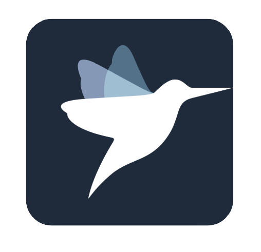

# javapractice
Java 문법 정리(with. Programmers) 

 
[자바 입문 프로그래머스](https://programmers.co.kr/learn/courses/5) 
[자바 중급 프로그래머스](https://programmers.co.kr/learn/courses/9) 
# 자바 실습정리.
자바 실습을 이것으로 정리하고 
개념관련된 부분들은 Notion으로 정리합니다.

